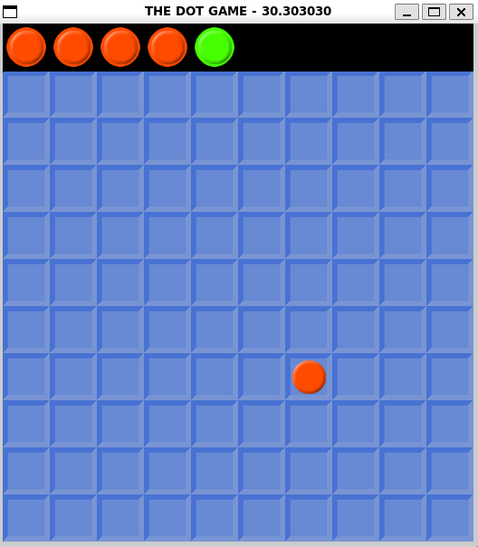

# The Dot Game

The Dot Game is a simple yet engaging puzzle game built in vanilla C++. The objective is to click on dots that appear on the screen using the correct mouse button based on their color.

## Screenshots

Here are some screenshots of the game:



## Description

In The Dot Game, players are presented with red and green dots that appear randomly on the screen. The challenge is to click on the dots using the correct mouse button:

- **Left Mouse Button** for **Red Dots**.
- **Right Mouse Button** for **Green Dots**.

The game tests your reflexes and accuracy as the dots appear and disappear quickly. The goal is to score as many points as possible by clicking the correct dots.

### Features

- Simple and intuitive gameplay mechanics.
- Randomly appearing red and green dots.
- Reflex-based challenge for players of all ages.
- Retro-style graphics and smooth performance.

## How to Play

1. **Start the game** and wait for dots to appear on the screen.
2. **Click on the dots**:
   - Use the **Left Mouse Button** for **Red Dots**.
   - Use the **Right Mouse Button** for **Green Dots**.
3. Avoid clicking the wrong dots or missing them.
4. Try to score as many points as possible before the game ends.

## Build and Run

To build and run the game, use the provided `Makefile`:

```bash
make build
make run
